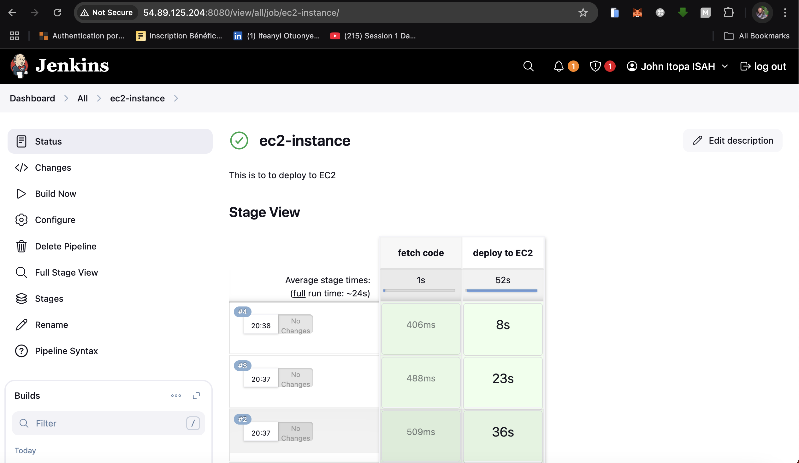

# Jenkins EC2 Deployment Pipelines 🚀

This repository contains multiple Jenkins pipelines designed to automate the deployment of a sample web application to AWS EC2 instances using various AWS connection strategies. It supports deployment via:

- **Direct SSH**
- **AWS EC2 Instance Connect Endpoint (EICE)**
- **AWS Systems Manager (SSM)**

It also includes a `websetup.sh` script used to install dependencies and deploy the application to the EC2 instance.

---

## 📂 Project Structure

```
.
├── Jenkinsfile           # Standard Jenkins pipeline (SSH-based deployment)
├── Jenkinsfile-EICE      # Jenkins pipeline using EC2 Instance Connect Endpoint
├── Jenkinsfile-SSM       # Jenkins pipeline using AWS Systems Manager (SSM)
├── README.md             # Project documentation
└── websetup.sh           # Bash script to configure the EC2 instance and deploy the web app
```


---

## 🌐 Overview

Each pipeline automates:

1. **Pulling source code** from a GitHub repository.
2. **Deploying a web application** (hosted in Apache) to an EC2 instance.
3. Handling deployment over **SSH**, **EICE**, or **SSM** depending on your Jenkinsfile configuration.

---

## 🔧 Requirements

Before using these pipelines, ensure the following:

- ✅ An AWS EC2 Ubuntu instance (properly configured and accessible).
- ✅ Jenkins server with:
  - AWS CLI installed and configured
  - [Jenkins AWS Credentials plugin](https://plugins.jenkins.io/aws-credentials/)
  - SSH Agent plugin
- ✅ IAM Role with sufficient permissions (EC2, SSM, S3)
- ✅ Your Jenkins server should assume this role or have access to AWS credentials
- ✅ A working `ssh` key added to Jenkins credentials (for `Jenkinsfile`)

---

## 📜 Jenkinsfile Variants

### 1. `Jenkinsfile` (SSH-based Deployment)

This pipeline:
- Connects to the EC2 instance using SSH and a Jenkins-managed private key.
- Copies `websetup.sh` using `scp`
- Executes the script remotely via `ssh`

🔑 **Credential Required**: SSH key (ID: `ec2`)

---

### 2. `Jenkinsfile-EICE` (EC2 Instance Connect Endpoint)

This pipeline:
- Uses `aws ec2-instance-connect ssh` via EICE to connect and deploy without traditional SSH.
- Requires the **EC2 Instance Connect Endpoint** and proper IAM permissions.

🛡️ **Security Advantage**: No inbound SSH rules required

---

### 3. `Jenkinsfile-SSM` (SSM-based Deployment)

This pipeline:
- Uploads `websetup.sh` to S3
- Executes it on EC2 via SSM Document: `AWS-RunShellScript`
- Monitors execution, prints logs, and archives command outputs

📦 **Benefits**:
- Agentless
- Great for closed-network deployments (no need to open port 22)

---

## 🛠 `websetup.sh`: EC2 Setup Script

This shell script does the following:

1. Updates the package list
2. Installs `apache2`, `wget`, `unzip`
3. Downloads a sample web template
4. Extracts it and copies it to `/var/www/html/`
5. Restarts the Apache service
6. Cleans up temporary files

### Script Overview:

```bash
#!/bin/bash

# Installing Dependencies
echo "Installing packages..."
sudo apt update -y > /dev/null
sudo apt install wget unzip apache2 -y > /dev/null

# Creating Temp Directory and Deploying Web App
mkdir -p /tmp/webfiles
cd /tmp/webfiles
wget https://www.tooplate.com/zip-templates/2132_clean_work.zip > /dev/null
unzip 2132_clean_work.zip > /dev/null
sudo cp -r 2132_clean_work/* /var/www/html/

# Restart Apache
sudo systemctl restart apache2

# Clean Up
sudo rm -rf /tmp/webfiles


---

## 📸 Deployment Results

Below are screenshots showing the successful deployment of the web application to an EC2 instance using Jenkins.

### ✅ Jenkins Pipeline Success

This shows the `ec2-instance` Jenkins pipeline running two stages: `fetch code` and `deploy to EC2`. All stages completed successfully.



---

### 🌐 Deployed Web Application on EC2

This screenshot shows the live website (`Clean Work`) running on the EC2 instance at `http://54.164.217.241`.

